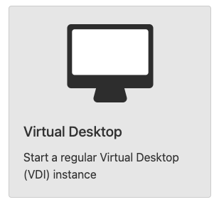
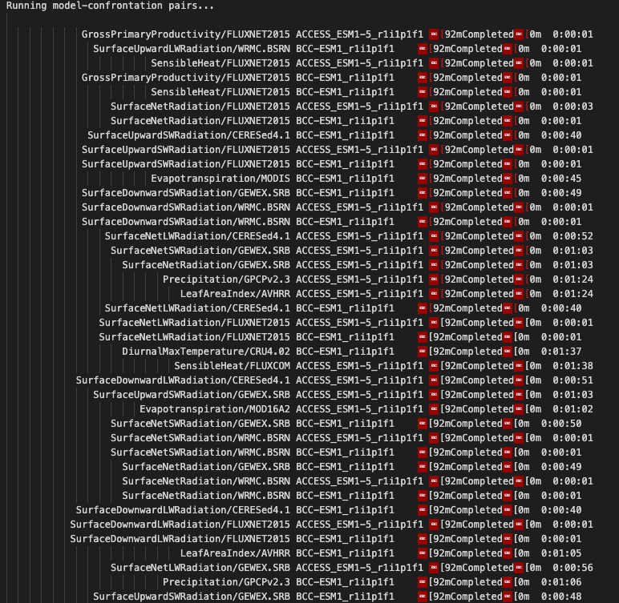
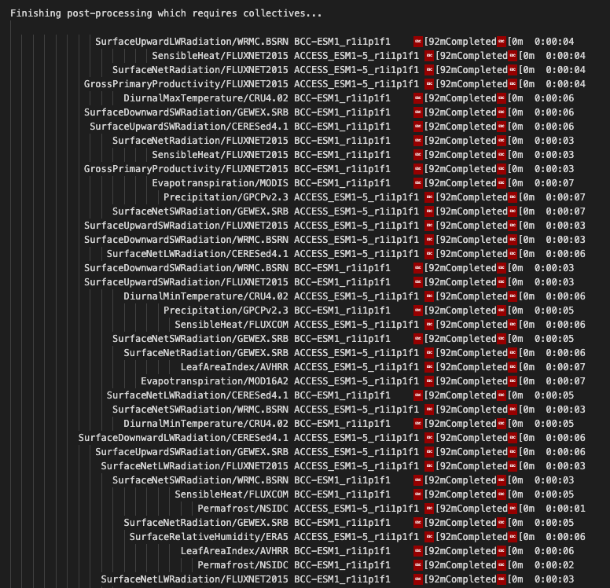
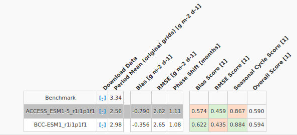

# ACCESS-NRI 2023 Workshop ILAMB Tutorial

This tutorial teach you how to run ILAMB on ARE in training section.

## STEP 1

First is to open ARE(Australian Research Environment) by this [link](https://are-auth.nci.org.au/auth/ldap/login?back=&state=rl5xnescpalo7gqjcfj7qkwpx). 


Use your NCI username and password to login

## STEP 2

When you login you wiil be in the dashboard page, there is a lot of APPs you can use in ARE.


INn this section we will use virtual dasktop instance(VDI)

## STEP 3
Next step is to initialise the VDI before launch it.

it's just like a PBS job if you have use NCI before. In this part you just follow this picture to initialize your VDI environment, then click launch at the bottom.

## STEP 4
When you get everything setup and click Launch button you'll be redirected to this page:

 

Maybe you will be in queue for a while, it depends on what kind of queue and how much source you apply, when the status at the top right turn to running, you can click `Launch VDI Desktop` to access your VDI.

## STEP 5
This is the Desktop of your VDI:


Then open a terminal, change directory to your dorectory in this training section

```
cd /scratch/nf33/$USER
```

## STEP 6
in this directory, we need you to clone the whole repo from github with command below(if you already have this repo in your directory, you can jump to STEP 7):
```
git clone https://github.com/ACCESS-NRI/NRI-Workshop2023-MED.git
```

Then you will have everything you need in your directory.

## STEP 7
```
cd /NRI-Workshop2023-MED/ilamb
```
go to ilamb directory,you will see everything we need to run ilamb on NCI, we have get everything set up so you don't need to organise anything, just use command below to trigger ilamb.
```
pbs run_ilamb.pbs
```


## STEP 8
After the process terminate, you can find details about the ilamb running process in output log file create by PBS.





you will have a `ilamb_result` directory which contain all the result create by ilamb, get into the directory:
```
cd ./ilamb_result/workshop
```
use commmand below to host a localserver.
```
python3 -m http.server
```

You can then start Firefox in the VDI screen and access the following address:
localhost address:
```
http://0.0.0.0:8000/
```
In this training, we use tow dataset as an example to show you how to use ilamb, you will view the ilamb result in yout localhost like this:


And you can see details by click each line of the list, below is an example.



# END
That's all about the tutorial, hope you like it, and you will find more details in [ilamb_tutorial](https://www.ilamb.org/doc/tutorial.html) and ACCESS-NRI tutorial about [how to use ilamb on NCI](https://ilamb-workflow.readthedocs.io/en/latest/) 